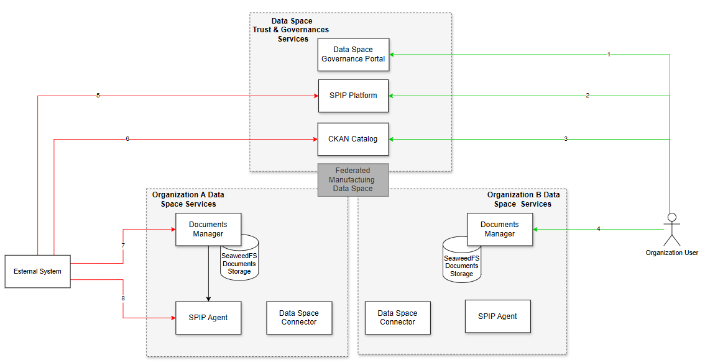
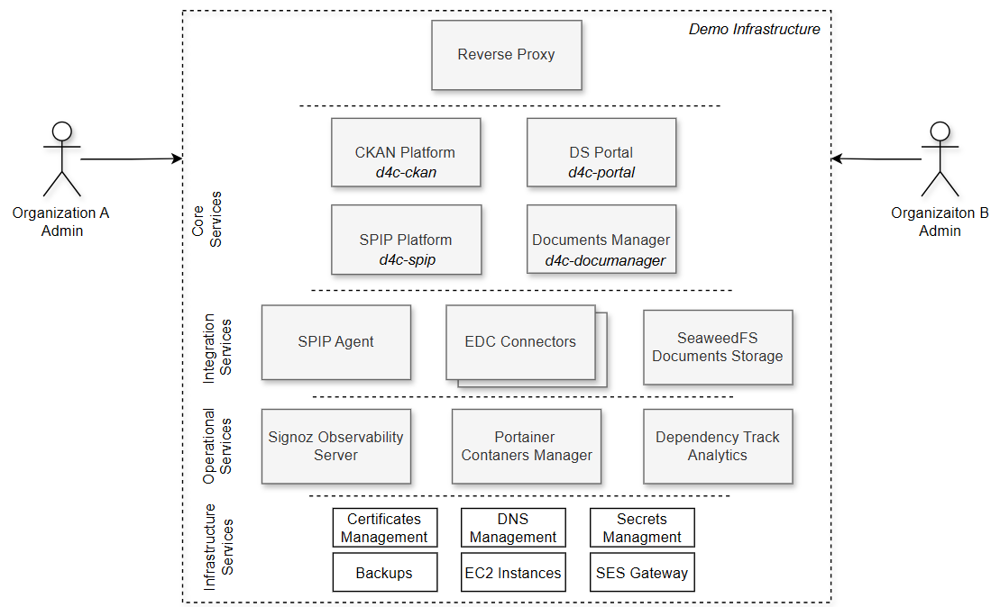

# WP3 Data Governance Platform — Architecture Overview

| |                                |
|---|--------------------------------|
| **Project** | DATA4CIRC                      |
| **Work Package** | WP3 — Data Governance Platform |
| **Document Type** | Technical Overview             |
| **Version** | *0.4.0-beta.9*                 |
| **Date** | *17.02.2026*                   |
| **Author(s)** | *Mihai H*                      |

---

## 1. Introduction

This document provides a technical overview of the WP3 Data Governance Platform architecture as part of the DATA4CIRC project. The platform is designed to enable trusted, interoperable, and secure data sharing across organizations participating in circular economy value chains. 
The architecture is organized around two logical layers: **Data Space Trust & Governance Services** (centralized platform services) and **Organization Data Space Services** (per-organization components).

### Companion Documents

This document is intended to be read alongside the following resources, which provide additional depth on specific topics:

- **D3.1 — Data Availability and Characterisation:** Defines the data characterization methodology, custom metadata fields, and CKAN platform configuration referenced throughout this document.
- **SPIP Encryption & Policy Documentation:** Provides detailed specifications of the encryption/decryption mechanisms, attribute management, and policy definitions used by the SPIP Platform and SPIP Agent.
- **User Manual:** Documents the step-by-step operational procedures for end users, including the manual document transfer workflow referenced in Section 10.

---

## 2. Architecture Components



### 2.1 Data Space Trust & Governance Services

This layer provides centralized services that manage trust, identity, governance, and metadata across the entire data space.

**Data Space Governance Portal**
The portal is the primary web-based entry point for organization administrators. It provides functionality for managing organization settings and serves as the interface through which the onboarding process is initiated and completed. Additionally, the portal offers utility interfaces that guide users through operations aligned with the platform's metadata model (as defined in Deliverable D3.1), such as assisted dataset publication in CKAN.

**SPIP Platform**
The SPIP (Security, Privacy, and Identity Platform) is responsible for managing encryption/decryption attributes and associated encryption policies based on Attribute-Based Encryption (ABE). It provides a dashboard where authorized users can manage their cryptographic attributes and access control policies. Detailed specifications on how SPIP encryption and policy mechanisms work are presented in a separate document. A default set of attributes and policies are created during onboarding so the organization administrator is not required to access the SPIP dashboard at this stage. 

**CKAN Catalog**
CKAN serves as the metadata publishing, discovery, and cataloging layer for the data space. It has been enhanced with DCAT-AP support (via the `ckanext-dcat` extension) to enable interoperability with European open data ecosystems. CKAN provides both a web interface for manual dataset management and a RESTful API for programmatic access. It is important to note that CKAN does not store the actual data or enforce access policies — it functions as a metadata layer pointing to resources managed by data space connectors or organization-level document storage. However, for demonstration purposes CKAN allows attaching some data directly to a dataset.

### 2.2 Organization Data Space Services

Each participating organization operates its own set of data space services. The diagram illustrates two organizations (Organization A and Organization B) with identical component stacks, reflecting the federated and symmetric nature of the architecture.

**Documents Manager**
The Documents Manager is the organization-level application through which users can upload, download, encrypt, and decrypt documents. It provides the primary interface for document lifecycle operations within the data space and acts as the bridge between the user and the underlying document storage and encryption services.

**SeaweedFS Documents Storage**
SeaweedFS is the distributed file storage system used at the organization level for persisting documents managed through the Documents Manager. It provides scalable and efficient storage for both plaintext and encrypted document files. This component is not directly accessible by end-user and is used behind the scene by Documents Manager for storing documents.

**SPIP Agent**
The SPIP Agent is the organization-level component that interfaces with the central SPIP Platform. It handles local encryption and decryption operations on behalf of the organization, applying the ABE policies and attributes provisioned during the onboarding process.

**Data Space Connector**
The Data Space Connector is the component responsible for enabling machine-to-machine data exchange between organizations within the federated data space. It implements the Dataspace Protocol for contract negotiation, policy enforcement, and secure data transfer between participants.

---

## 3. Interaction Patterns

The architecture supports two distinct categories of interactions, visually distinguished in the diagram by color coding.

### 3.1 End-User Interactions via Web Interfaces (Green Arrows)

Green arrows represent interactions that are available to end users through web-based graphical interfaces. These interactions are numbered 1 through 4 in the diagram and correspond to the following flows:

**(1) Data Space Governance Portal**
The organization user accesses the Governance Portal via a web browser to manage their organization settings, initiate onboarding-related activities, and use utility interfaces for guided dataset publication.

**(2) SPIP Platform Dashboard**
The organization user logs into the SPIP Platform dashboard to manage encryption/decryption attributes and access control policies associated with their organization.

**(3) CKAN Catalog Web Interface**
The organization user accesses the CKAN web interface directly to publish datasets, search for datasets published by other organizations, browse metadata, and manage their organization's catalog entries.

**(4) Documents Manager**
The organization user interacts with the Documents Manager to upload and download documents, as well as to encrypt and decrypt documents using the policies provisioned through the SPIP Platform.

### 3.2 External System Interactions via API (Red Arrows)

Red arrows represent programmatic interactions between platform components and external systems via API endpoints. These interactions are numbered 5 through 8 in the diagram and correspond to the following integration points:

**(5) SPIP Platform API**
External systems can interact with the SPIP Platform programmatically to manage encryption attributes and policies.

**(6) CKAN Catalog API**
External systems can interact with the CKAN Catalog via its RESTful API for programmatic dataset creation, metadata retrieval, search operations, and resource management. Access is authenticated using API tokens generated during the onboarding process.

**(7) Documents Manager API**
External systems can interact with the Documents Manager API for programmatic document upload, download, encryption, and decryption operations.

**(8) SPIP Agent API**
External systems can interact with the SPIP Agent at the organization level for local encryption/decryption operations.

---

## 4. External System Integration

In the high-level architecture diagram, the **External System** component represents any tool or system that is not part of the Data Governance Platform itself. This includes both digital tools developed within other DATA4CIRC work packages (e.g., LCA tools, Digital Product Passport applications, Digital Twin platforms) and systems entirely outside the DATA4CIRC project.

### 4.1 Available Capabilities for External Systems

In the current version of the platform, an external system can perform the following operations by integrating with the appropriate platform APIs:

- **Publish datasets** in the CKAN Catalog via the CKAN REST API (see Section 8.2)
- **Search for datasets** published by other organizations via the CKAN REST API
- **Upload and download documents** via the Documents Manager API (see Section 8.3)
- **Encrypt and decrypt documents** via the SPIP Platform API or SPIP Agent API (see Section 8.1)

Each of these capabilities is accessible through the API of the respective platform component, as detailed in the API integration sections of this document. It should be noted that the platform does not currently expose a single unified API — external systems must integrate with each component individually using the authentication model specific to that component.

| Capability | Platform Component | Authentication Model | API Details |
|---|---|---|---|
| Publish and search datasets | CKAN Catalog | API token | Section 8.2 |
| Upload and download documents | Documents Manager | SPIP-based API key | Section 8.3 |
| Encrypt and decrypt documents | SPIP Platform / SPIP Agent | JWT Bearer token | Section 8.1 |

### 4.2 Connector-Based Integration via Onboarding

The Data Governance Portal defines a generic concept of **Connector** (distinct from the Dataspace Connector used for machine-to-machine data exchange). In this context, a Connector represents any digital tool that an organization can access as part of its data space participation.

The portal's onboarding process can be customized to automatically establish integrations with external tools when an organization is onboarded. By extending the onboarding workflow, the platform can — for example — initiate account creation in an external system and register the tool as a Connector for the newly onboarded organization. Once registered, these Connectors appear in the organization's **My Connectors** interface within the portal, which presents a card-based overview of all digital tools available to the user.

This mechanism provides an extensible pattern for incorporating new external tools into the data governance ecosystem without modifying the core platform architecture.

---

## 5. Organization Onboarding Process

The onboarding process is a critical prerequisite for any organization to participate in the data space. At the current stage of the platform, the onboarding process does not expose a self-service API and must be performed manually by a designated administrator using a real email address for identity verification.

The onboarding workflow proceeds as follows:

1. **Onboarding Request Submission:** A representative of the organization submits an onboarding request. This request must be associated with a real person and a verified email address.

2. **Request Validation:** The onboarding request is reviewed and validated by a platform administrator.

3. **Organization Account Creation:** Upon approval, the organization account is created across the platform's governance services.

4. **Credential Provisioning — Governance Portal:** A first set of credentials is generated specifically for the Data Space Governance Portal. These credentials are used exclusively for authenticating into the portal and managing the organization's settings.

5. **Credential Provisioning — SPIP Platform:** A second set of credentials is generated for the SPIP Platform. This includes the creation of encryption/decryption attributes and the associated encryption policy (based on ABE). The details of the attributes and policies provisioned during this step are described in Section 6.

6. **CKAN Initialization:** The second set of credentials (SPIP) is also used to initialize the organization and its associated user account within the CKAN platform.

7. **API Token Generation:** For enabling programmatic access and operational convenience, an API token is generated within CKAN. This token is communicated to the organization representative together with the credentials upon onboarding approval.

Upon completion of the onboarding process, the organization user receives two sets of credentials (Portal and SPIP/CKAN) plus a CKAN API token, enabling full participation in the data space through both web interfaces and API integrations.

---

## 6. ABE Attributes and Policies Provisioning

During onboarding, the portal provisions a set of Attribute-Based Encryption (ABE) attributes and access policies on the SPIP Platform. These form the cryptographic identity of the organization within the data space and govern who can encrypt and decrypt documents.

### 6.1 Encryption and Decryption Attributes

Four attributes are created for each organization, assigned to both the encryption resource (`encrypt_attribute_list`) and decryption resource (`decrypt_attribute_list`) symmetrically. All attributes use `string` as both their data type and logic group.

| Attribute | Value Source | Example Value | Purpose |
|-----------|-------------|---------------|---------|
| `orgType` | Mapped from onboarding request `companyType` field | `manufacturer` | Identifies the type of organization |
| `industrySector` | Sanitized from onboarding request `industry` field | `automotive` | Identifies the organization's industry sector |
| `orgId` | SPIP username generated during user creation | `greentech_solutions` | Unique organization identifier within SPIP |
| `data4circ_partner` | Hardcoded | `true` | Marks the organization as a DATA4CIRC consortium partner |

### 6.2 Encryption Policies

Two ABE encryption policies are created for each organization:

**1. Organization Access Policy**

- **Label:** `{sanitized_company_name}_access_policy` (e.g., `green_tech_solutions_access_policy`)
- **Expression:** `string:orgType-is-{orgType} and string:industrySector-is-{industrySector}`
- **Example:** `string:orgType-is-manufacturer and string:industrySector-is-automotive`
- **Purpose:** Restricts document access to users whose SPIP attributes match the encrypting organization's type and industry sector. A provider can use this policy when encrypting a document so that only organizations of the same type and sector can decrypt it.

**2. Partner Verification Policy**

- **Label:** `data4circ_partner_verification`
- **Expression:** `string:data4circ_partner-is-true`
- **Purpose:** Restricts document access to any verified DATA4CIRC consortium partner. This is a broader policy — any onboarded organization can decrypt documents encrypted with this policy.

### 6.3 How Policies Are Used

When a user encrypts a document through the Documents Manager, they select one of their available ABE policies. The SPIP Agent applies the policy expression to the document. A consumer can only decrypt the document if their own SPIP decryption attributes satisfy the policy expression. This enables controlled cross-organization sharing based on organizational characteristics.

### 6.4 ABE Attributes and Policies Provisioned on Collaboration Approval

When two organizations establish a formal collaboration through the portal's collaboration request workflow, additional ABE attributes and a collaboration-specific encryption policy are automatically provisioned in SPIP for both organizations. This enables targeted, pairwise-exclusive document exchange — where only the specific collaborating partner can decrypt the shared content.

#### Collaboration Request Workflow Overview

A collaboration is initiated when an Organization Administrator sends a collaboration request to another organization via the portal. The target organization's administrator reviews the request and approves or rejects it. Notifications are delivered both in-portal and via email at each stage. Upon approval, SPIP provisioning is triggered symmetrically for both organizations.

For a step-by-step walkthrough of the collaboration UI and document exchange workflow, refer to the **Collaboration Requests** section of the User Manual.

#### Attributes Added Per Organization on Approval

Three attributes are added to each organization's SPIP user on collaboration approval. All attributes use `string` as both their data type and logic group and have value `"true"`.

| Attribute Name | Resource | Purpose |
|---|---|---|
| `is_partner_of_{own_spip_username}` | Encryption | Marks the organization as a collaboration-capable encryptor for its own identity |
| `is_partner_of_{own_spip_username}` | Decryption | Enables the organization to decrypt documents encrypted with its own partner policy |
| `is_partner_of_{partner_spip_username}` | Decryption | Enables the organization to decrypt documents encrypted by the partner using their partner policy |

**Example** — Collaboration between Organization A (`greentech_solutions`) and Organization B (`ecorecycle_corp`):

| Organization | Attribute | Resource | Value |
|---|---|---|---|
| Org A | `is_partner_of_greentech_solutions` | Encryption | `true` |
| Org A | `is_partner_of_greentech_solutions` | Decryption | `true` |
| Org A | `is_partner_of_ecorecycle_corp` | Decryption | `true` |
| Org B | `is_partner_of_ecorecycle_corp` | Encryption | `true` |
| Org B | `is_partner_of_ecorecycle_corp` | Decryption | `true` |
| Org B | `is_partner_of_greentech_solutions` | Decryption | `true` |

#### Collaboration Policy Added Per Organization on Approval

One ABE encryption policy is created on each organization's SPIP account:

| Organization | Policy Label | Policy Expression |
|---|---|---|
| Org A | `data4circ_collaboration_partner_verification` | `string:is_partner_of_greentech_solutions-is-true` |
| Org B | `data4circ_collaboration_partner_verification` | `string:is_partner_of_ecorecycle_corp-is-true` |

In general, the policy expression for any organization is: `string:is_partner_of_{own_spip_username}-is-true`.

#### How the Pairwise Collaboration Policy Works

The collaboration policy enables symmetric bilateral encryption:

- **Org A encrypts** a document using their `data4circ_collaboration_partner_verification` policy (expression: `string:is_partner_of_greentech_solutions-is-true`). Only a SPIP user holding the decryption attribute `is_partner_of_greentech_solutions = true` can decrypt the result. Org B received exactly that decryption attribute on approval, so they can decrypt.
- **Org B encrypts** a document using their `data4circ_collaboration_partner_verification` policy (expression: `string:is_partner_of_ecorecycle_corp-is-true`). Only a SPIP user holding the decryption attribute `is_partner_of_ecorecycle_corp = true` can decrypt. Org A received that attribute on approval, so they can decrypt.

If either organization forms additional collaborations in the future, the new partner's `is_partner_of_{new_partner}` decryption attribute is appended without affecting existing collaboration policies.

#### Comparison with Other Policies

| Policy | Scope | Decryptable By |
|---|---|---|
| `{org}_access_policy` | Sector/type match | Any org with the same `orgType` and `industrySector` |
| `data4circ_partner_verification` | Platform-wide | Any onboarded DATA4CIRC partner |
| `data4circ_collaboration_partner_verification` | Pairwise | Only the specific collaborating partner org |

The collaboration policy provides the narrowest access scope and is the appropriate choice when a document is intended exclusively for a known bilateral partner.

---

## 7. Example Workflow: Secure Cross-Organization Document Sharing

The platform enables users from different organizations to share documents securely using the combination of encryption, document management, and metadata cataloging services. The following example illustrates a typical provider-to-consumer document sharing workflow.

### 7.1 Provider Side (Organization A)

1. The provider user logs into the **Documents Manager** (web interface).
2. The user uploads a document to the Documents Manager, which stores it in the organization's **SeaweedFS** storage.
3. The user encrypts the document using a specific ABE policy through the Documents Manager. The encryption operation leverages the **SPIP Agent** and the attributes/policies provisioned during onboarding.
4. The user downloads the encrypted document from the Documents Manager.
5. The user prepares the encrypted document for sharing via the **CKAN Catalog**:
   - The user creates a new dataset entry in CKAN and attaches the encrypted document as a resource to the published dataset.
   - Dataset publication can be performed in two ways:
     - **Directly via the CKAN web interface**, where the user manually fills in metadata fields.
     - **Via the utility interface provided in the Governance Portal**, which guides the user in selecting metadata fields aligned with the proposed metadata model defined in Deliverable D3.1. This approach is recommended as it ensures consistency with the project's data characterization methodology.

### 7.2 Consumer Side (Organization B)

1. The consumer user browses or searches the **CKAN Catalog** to discover available datasets.
2. The consumer identifies the dataset published by Organization A and downloads the attached encrypted document.
3. The consumer uses their own **Documents Manager** to decrypt the document, provided their SPIP attributes satisfy the ABE policy applied by the provider during encryption.

This workflow ensures that data sovereignty is maintained, encryption policies are enforced at the document level, and sharing is facilitated through standardized metadata discovery via CKAN.

---

## 8. API Integration with External Systems

Several platform components expose API endpoints to enable programmatic integration with external systems. This capability is essential for automating workflows, integrating with existing enterprise systems, and enabling machine-to-machine data exchange scenarios.

### 8.1 SPIP Platform, Documents Manager & SPIP Agent — Authorization Model

The SPIP Platform and the organization-level SPIP Agent share the same REST API authorization model. Any external system integrating with either component follows the identical authentication flow described below.

#### Authentication Flow

All API interactions require a valid **JWT Bearer token** obtained via the login endpoint:

```
POST {spip-base-url}/user/login
Content-Type: application/json

{
  "customer_tag": "<customer-identifier>",
  "username": "<username>",
  "password": "<password>"
}
```

The response contains an `access_token` (signed JWT). Its payload includes a `uid` claim identifying the SPIP user. All subsequent API calls pass this token as:

```
Authorization: Bearer <access_token>
```

Tokens are short-lived. A fresh login should be performed before each operation sequence.

#### Dual-Token Authorization

The platform uses two authorization scopes depending on the credentials used:

| Token Type | Obtained With | Scope |
|------------|---------------|-------|
| **Admin token** | Platform administrator credentials | User creation, role assignment, attribute and policy management |
| **Organization user token** | Per-organization credentials (provisioned during onboarding) | Read-only access to own attributes and policies |

Administrative operations require admin-level authentication, while organization-level read operations are scoped to the authenticated organization's own data.

#### SPIP Agent — Same Model

The SPIP Agent deployed at the organization level uses the same authentication mechanism as the central SPIP Platform. The only difference is the base URL, which points to the organization's local SPIP Agent instance. A client that can authenticate with the central platform can interact with any SPIP Agent without changes to the authentication logic.

### 8.2 CKAN Catalog — Authorization Model

The CKAN Catalog uses **API token-based authentication** for all programmatic interactions. Unlike the SPIP Platform's JWT login flow, CKAN relies on long-lived API tokens that are passed directly in the HTTP `Authorization` header. The platform employs a dual-token model to separate administrative operations from organization-scoped data operations.

#### Token Types

| Token Type | Scope | Provisioned By | Used For |
|------------|-------|----------------|----------|
| **Admin token** | Platform-wide | Platform administrator (configured as environment variable) | Organization creation, user creation, membership management, API token generation |
| **Per-organization token** | Single organization | Generated automatically during onboarding (Steps 6–7) | Dataset creation, metadata management, resource operations on behalf of the organization |

#### Authentication Header

All CKAN API calls include the token directly in the `Authorization` header without a `Bearer` prefix:

```
Authorization: <api-token>
```

This follows the standard CKAN API authentication convention. The token identifies both the user and their associated organization permissions.

The following example demonstrates how an organization can use its API token to list datasets belonging to its CKAN organization:

```bash
curl -H "Authorization: <your-api-token>" \
  "https://<ckan-instance-url>/api/3/action/package_search?fq=owner_org:<your-organization-id>"
```

#### Per-Organization Token Lifecycle

Per-organization API tokens are generated as part of the CKAN synchronization step during onboarding:

1. **Generation:** The portal calls the CKAN API (`/api/3/action/api_token_create`) using admin credentials to create a token for the organization's CKAN user. The token is returned only once and cannot be retrieved again.
2. **Temporary storage:** The token is stored in encrypted form on the onboarding request record until the request is approved.
3. **Permanent storage:** Upon approval, the token is transferred to the organization's CKAN connector record (encrypted at rest), where it is used for all subsequent API operations on behalf of that organization.
4. **Distribution:** The token is communicated to organization admin via confirmation onboarding email. The token can be viewed by the organization administrator in the CKAN connector edit view in the portal. 

### 8.4 API Documentation References

The table below provides links to the available API documentation for each platform component.

| Component          | API Documentation                                                               | Details                                                                                                                                 |
|--------------------|---------------------------------------------------------------------------------|-----------------------------------------------------------------------------------------------------------------------------------------|
| D4C Portal         | N/A                                                                             | Web UI for onboarding and governance                                                                                                    |
| SPIP Platform      | [SPIP Platform API docs](https://aabac.australiaeast.cloudapp.azure.com/ui/#/)  | JWT login, admin/org scopes, Swagger UI                                                                                                 |
| SPIP Agent         | [SPIP Agent API docs](https://inno-dpp.github.io/d4c-api-docs/)                 | Local agent API; same auth model as SPIP. From dropdown select Sekurra.                                                                 |
| CKAN Catalog       | [CKAN Catalog API docs](https://docs.ckan.org/en/2.11/api/)                     | CKAN REST API v3; token-based auth                                                                                                      |
| Documents Manager  | [Documents Manager API docs location](https://inno-dpp.github.io/d4c-api-docs/) | Document upload/download/encryption; X-API-Key auth. From dropdown select Documents Manager                                             |
| EDC Management API | [EDC Management API docs](https://inno-dpp.github.io/d4c-api-docs/)             | EDC connector management endpoints; connector lifecycle and contract negotiation; no authorization. From dropdown select EDC Management |
| EDC Wrapper API    | [EDC Wrapper API docs](https://inno-dpp.github.io/d4c-api-docs/)                | Wrapper APIs for EDC integrations; no authorization.  From dropdown select EDC Wrapper                                                  |

---

## 9. Deployment



The diagram illustrates the current deployment model for WP3 Data Governance Platform services. For demonstration and development purposes, all services are currently co-deployed within a single demo infrastructure hosted on cloud services and accessible under subdomains of a common data-space domain. An **Nginx reverse proxy** handles subdomain-based routing and TLS termination for all platform services; as an infrastructure-level component, it is not represented in the architecture diagram (Section 2) but is a key element of the deployment model.

The top tier represents the core platform services exposed to organization users via web interfaces. Organization users from all organizations interact with these services directly. The middle tier contains the backend and integration services that operate programmatically. The operational layer includes infrastructure observability and management tools. Finally, the infrastructure foundation at the bottom encompasses the underlying AWS cloud services and operational tooling.

### 9.1 Operational Tools

The operational layer of the platform relies on three dedicated tools that provide observability, container management, and supply chain security across all deployed services.

* **SigNoz Observability Server** serves as the centralized monitoring and observability platform. It collects metrics, distributed traces, and logs from all platform services, providing real-time dashboards, alerting, and performance analysis. SigNoz enables operators to identify bottlenecks, diagnose failures, and monitor service-level indicators across the entire deployment.
* **Portainer Containers Manager** provides a web-based interface for Docker container orchestration and lifecycle management. Through Portainer, operators can deploy, start, stop, and inspect containers, view resource consumption, and manage service health across the infrastructure. It simplifies day-to-day operational tasks without requiring direct command-line access to the host systems.
* **Dependency-Track Analytics** addresses software supply chain security by continuously analyzing Software Bills of Materials (SBOMs) generated from platform components. It identifies known vulnerabilities in third-party dependencies, tracks risk exposure over time, and supports policy-driven alerting to ensure that security issues are detected and addressed proactively.

### 9.2 Cloud Infrastructure Services

The platform is hosted on Amazon Web Services (AWS), with all resources deployed in European regions to comply with data residency requirements. The underlying cloud infrastructure relies on several AWS managed services that provide foundational capabilities for security, compute, storage, and communication.

* **Certificates Management** is handled through AWS Certificate Manager (ACM), which automates the provisioning and renewal of TLS/SSL certificates used by the Nginx reverse proxy to secure all HTTPS communications with platform services.
* **DNS Management** is provided by the cloud DNS service, which manages the data-space domain and all associated subdomain records, ensuring reliable resolution of service-specific subdomains to the appropriate infrastructure endpoints.
* **Secrets Management** is implemented using AWS Secrets Manager, which securely stores sensitive configuration.
* **Backups** are managed through AWS Data Lifecycle Manager (DLM), which automates the creation and retention of EBS volume snapshots with daily snapshot policies to ensure consistent recovery points.
* **EC2 Instances** provide the compute infrastructure on which all platform services are deployed as Docker containers, using Ubuntu-based instances.
* **SES Gateway** leverages Amazon Simple Email Service (SES) to handle outbound email communications, including user invitation notifications, credential delivery, and system alerts.

In a production deployment scenario, the centralized Trust & Governance Services and the per-organization Data Space Services would be separated and deployed independently, with each organization hosting its own connector and storage components within its own infrastructure. The current unified deployment simplifies development, testing, and demonstration activities during this phase of the project.

---

## 10. Constraints and Limitations

This section documents the current constraints and known limitations of the platform deployment as of the present phase of the project.

**EDC Connector — Document Transfer Not Yet Supported.** Demo Eclipse Dataspace Connector (EDC) instances are deployed and available on the infrastructure. However, automated document transfer via connectors is not yet supported for documents stored in the Documents Manager. Currently, document exchange between organizations follows a manual transfer workflow as documented in the user manual.

**SPIP Agent — Not Yet Available for External Integration.** The SPIP Agent deployed at the organization level is used internally by platform services for encryption and decryption operations, but it is not yet ready to be consumed by external components. Organizations or external systems that require encryption and decryption services should use the central SPIP Platform directly — the API is identical (see Section 8.1).

**Additional Services Out of Scope.** Other services are also deployed on the shared infrastructure, including AAS (Asset Administration Shell) Services and the DPP (Digital Product Passport) Demo Application. These components are not described in this document as they fall outside the scope of the WP3 Data Governance Platform architecture.

---

## 11. References

- **D3.1 — Data Availability and Characterisation:** Defines the data characterization methodology, custom metadata fields, and CKAN platform configuration for the DATA4CIRC project.
- **SPIP Encryption & Policy Documentation:** Separate document detailing the encryption/decryption mechanisms, attribute management, and policy specification for the SPIP Platform. - LINK TO BE ADDED
- **SeaweedFS:** Distributed storage service — [https://seaweedfs.com/](https://seaweedfs.com/)
- **SigNoz:** Open-source observability platform — [https://signoz.io](https://signoz.io)
- **Portainer:** Container management platform — [https://www.portainer.io](https://www.portainer.io)
- **Dependency-Track:** Software supply chain security platform — [https://dependencytrack.org](https://dependencytrack.org)
