# Developer Workflow Guide

**DATA4CIRC Portal - Feature Development & Deployment Guide**

This document explains the complete development workflow for implementing features, creating releases, and deploying to production using our CI/CD pipeline.

---

## Table of Contents

1. [Overview](#overview)
2. [CI/CD Pipeline Architecture](#cicd-pipeline-architecture)
3. [Feature Development Workflow](#feature-development-workflow)
4. [Conventional Commit Messages](#conventional-commit-messages)
5. [Pull Request Process](#pull-request-process)
6. [Automated Release Process](#automated-release-process)
7. [Production Deployment](#production-deployment)
8. [Docker Image Management](#docker-image-management)
9. [Troubleshooting](#troubleshooting)

---

## Overview

The DATA4CIRC Portal uses a fully automated CI/CD pipeline built with GitHub Actions that:

- ✅ Automatically tests every commit and pull request
- 🐳 Builds Docker images for every merge to develop/main
- 🏷️ Creates semantic versions based on commit messages
- 📦 Publishes Docker images to GitHub Container Registry (GHCR)
- 🚀 Generates GitHub releases with changelogs
- 📝 Maintains CHANGELOG.md automatically

**Key Technologies:**
- **CI/CD**: GitHub Actions
- **Versioning**: Semantic Release with Conventional Commits
- **Container Registry**: GitHub Container Registry (ghcr.io)
- **Deployment**: Docker Compose with production profile

---

## CI/CD Pipeline Architecture

### Workflow Files

Our pipeline consists of two main workflows located in `.github/workflows/`:

#### 1. **CI Workflow** (`ci.yml`)
**Triggers:** All branches and pull requests
**Purpose:** Quality assurance and validation

**Jobs:**
- **test**: Compiles code and runs unit tests
- **code-quality**: Checks code formatting and dependencies
- **build-verification**: Packages application JAR

**Timeline:** ~5-10 minutes

#### 2. **Build & Push Workflow** (`build-push.yml`)
**Triggers:** Pushes to `main`, `master`, or `develop` branches
**Purpose:** Build, version, and release

**Jobs:**
1. **semantic-version**: Determines next version from commit messages
2. **build-and-push**: Builds and pushes Docker image to GHCR
3. **create-release**: Creates GitHub release with changelog

**Timeline:** ~10-15 minutes

### Version Strategy

The pipeline uses **Semantic Versioning** (SemVer) with branch-specific behavior:

| Branch | Version Format | Example | Use Case |
|--------|---------------|---------|----------|
| `main`/`master` | `v{major}.{minor}.{patch}` | `v1.2.3` | Production releases |
| `develop` | `v{major}.{minor}.{patch}-beta.{n}` | `v0.1.0-beta.2` | Beta releases |
| `alpha` | `v{major}.{minor}.{patch}-alpha.{n}` | `v0.1.0-alpha.1` | Alpha releases |

---

## Feature Development Workflow

Follow these steps to implement a new feature:

### Step 1: Create Feature Branch

Always branch from `develop` for new features:

```bash
# Ensure you're on develop and up to date
git checkout develop
git pull origin develop

# Create feature branch (use descriptive name)
git checkout -b feature/add-user-dashboard

# Or for bug fixes
git checkout -b fix/login-timeout-issue
```

**Branch Naming Convention:**
- `feature/*` - New features
- `fix/*` - Bug fixes
- `refactor/*` - Code refactoring
- `docs/*` - Documentation updates
- `test/*` - Test improvements

### Step 2: Implement Your Changes

Develop your feature following best practices:

```bash
# Make changes to code
vim src/main/java/com/data4circ/portal/controller/DashboardController.java

# Test locally
mvn spring-boot:run -Dspring-boot.run.profiles=dev

# Run tests
mvn test

# Build to verify
mvn clean package
```

### Step 3: Commit with Conventional Commits

Commit your changes using conventional commit format (see next section):

```bash
# Stage your changes
git add .

# Commit with conventional format
git commit -m "feat: add user dashboard with activity metrics"

# Or for bug fixes
git commit -m "fix: resolve login timeout after 30 minutes"
```

### Step 4: Push Feature Branch

```bash
# Push to remote
git push origin feature/add-user-dashboard
```

**What happens:**
- ✅ CI workflow runs automatically
- ✅ Tests execute
- ✅ Code quality checks run
- ✅ Build verification completes

### Step 5: Create Pull Request

1. Go to GitHub repository
2. Click "Compare & pull request"
3. **Base branch**: `develop`
4. **Compare branch**: `feature/add-user-dashboard`
5. Fill in PR template:
   ```markdown
   ## Description
   Add user dashboard with real-time activity metrics

   ## Changes
   - Created DashboardController
   - Added dashboard view template
   - Implemented metrics service

   ## Testing
   - [x] Unit tests pass
   - [x] Manual testing completed
   - [x] UI reviewed in dev environment

   ## Screenshots
   [Add relevant screenshots]
   ```
6. Request review from team members
7. Assign labels (e.g., `feature`, `enhancement`)

**What happens:**
- ✅ CI workflow runs on PR
- ✅ Status checks display in PR
- ✅ Reviewers notified

### Step 6: Code Review & Merge

After approval:

```bash
# Option 1: Merge via GitHub UI (recommended)
# Click "Squash and merge" or "Merge pull request"

# Option 2: Merge via command line
git checkout develop
git pull origin develop
git merge --no-ff feature/add-user-dashboard
git push origin develop
```

**What happens:**
- 🚀 Build & Push workflow triggers
- 🏷️ New beta version created (e.g., `v0.1.0-beta.3`)
- 🐳 Docker image built and pushed to GHCR
- 📦 GitHub release created
- 📝 CHANGELOG.md updated

### Step 7: Verify Deployment Artifacts

Check that everything was created successfully:

1. **GitHub Actions Tab**: Verify workflows passed
2. **Releases Tab**: Confirm new release exists
3. **Packages Tab**: Verify Docker image pushed

```bash
# View latest release
gh release view

# Pull Docker image
docker pull ghcr.io/inno-dpp/d4c-portal:v0.1.0-beta.3

# Or pull latest develop image
docker pull ghcr.io/inno-dpp/d4c-portal:develop
```

---

## Conventional Commit Messages

Conventional commits are **required** for automatic versioning. The format is:

```
<type>(<scope>): <description>

[optional body]

[optional footer]
```

### Commit Types

| Type | Description | Version Bump | Example |
|------|-------------|--------------|---------|
| `feat` | New feature | **Minor** (0.1.0 → 0.2.0) | `feat: add user authentication` |
| `fix` | Bug fix | **Patch** (0.1.0 → 0.1.1) | `fix: resolve database connection timeout` |
| `perf` | Performance improvement | **Patch** | `perf: optimize query performance` |
| `refactor` | Code refactoring | **Patch** | `refactor: simplify user service logic` |
| `docs` | Documentation only | None | `docs: update API documentation` |
| `test` | Test changes | None | `test: add unit tests for auth service` |
| `chore` | Maintenance tasks | None | `chore: update dependencies` |
| `ci` | CI/CD changes | None | `ci: add Docker build caching` |
| `style` | Code formatting | None | `style: fix indentation` |
| `build` | Build system changes | None | `build: update Maven plugins` |

### Breaking Changes

For breaking changes that require a **major version bump** (1.0.0 → 2.0.0):

```bash
# Option 1: Use ! after type
git commit -m "feat!: redesign authentication API"

# Option 2: Add BREAKING CHANGE in footer
git commit -m "feat: redesign authentication API

BREAKING CHANGE: The login endpoint now requires OAuth2 tokens instead of basic auth."
```

### Scopes (Optional)

Add scope for better organization:

```bash
git commit -m "feat(auth): add OAuth2 support"
git commit -m "fix(dashboard): correct metric calculation"
git commit -m "docs(api): update endpoint documentation"
```

### Multi-line Commits

For detailed commits:

```bash
git commit -m "feat: implement user dashboard

- Add DashboardController with metrics endpoints
- Create dashboard view with Bootstrap 5 components
- Implement real-time activity tracking
- Add unit tests for dashboard service

Closes #42"
```

### Examples

**Good Examples:**
```bash
✅ feat: add user dashboard with activity metrics
✅ fix: resolve login timeout after 30 minutes
✅ perf: optimize database query for large datasets
✅ refactor: simplify organization service logic
✅ docs: update development setup instructions
✅ feat(spip): integrate attribute management API
✅ fix(connector): handle null values in status check
```

**Bad Examples:**
```bash
❌ Added dashboard (missing type)
❌ Update (not descriptive)
❌ WIP (work in progress - should not be pushed)
❌ fixed stuff (not conventional format)
❌ feature: new dashboard (wrong type name)
```

---

## Pull Request Process

### Before Creating PR

**Checklist:**
- [ ] Code compiles without errors
- [ ] All tests pass locally (`mvn test`)
- [ ] New tests added for new functionality
- [ ] Code follows project style guidelines
- [ ] Documentation updated if needed
- [ ] Commits follow conventional format
- [ ] Branch is up to date with develop

```bash
# Update your branch with latest develop
git checkout develop
git pull origin develop
git checkout feature/your-feature
git rebase develop
```

### PR Template

Use this template for your PR description:

```markdown
## Description
Brief description of what this PR does

## Type of Change
- [ ] Bug fix (non-breaking change which fixes an issue)
- [ ] New feature (non-breaking change which adds functionality)
- [ ] Breaking change (fix or feature that would cause existing functionality to not work as expected)
- [ ] Documentation update

## Changes Made
- Change 1
- Change 2
- Change 3

## Testing Performed
- [ ] Unit tests added/updated
- [ ] Integration tests pass
- [ ] Manual testing completed
- [ ] Tested in development environment

## Screenshots (if applicable)
[Add screenshots or GIFs]

## Related Issues
Closes #123
Relates to #456

## Deployment Notes
Any special deployment considerations

## Checklist
- [ ] My code follows the project style guidelines
- [ ] I have performed a self-review of my code
- [ ] I have commented my code, particularly in hard-to-understand areas
- [ ] I have made corresponding changes to the documentation
- [ ] My changes generate no new warnings
- [ ] I have added tests that prove my fix is effective or that my feature works
- [ ] New and existing unit tests pass locally with my changes
- [ ] Any dependent changes have been merged and published
```

### Review Process

1. **Automated Checks**: Wait for CI to pass
2. **Peer Review**: At least one approval required (recommended)
3. **Address Feedback**: Make requested changes
4. **Update PR**: Push additional commits
5. **Final Approval**: Get approval from reviewers
6. **Merge**: Merge into develop

### Merge Strategies

**Recommended: Squash and Merge**
- Combines all commits into one
- Creates clean history
- Preserves conventional commit format

```bash
# Example squashed commit
feat: add user dashboard (#42)

* Initial dashboard implementation
* Add metrics service
* Update tests
* Address review comments
```

---

## Automated Release Process

### How It Works

When you merge to `develop` or `main`:

1. **Semantic Version Job**:
   - Analyzes commit messages since last release
   - Determines next version using semantic-release
   - Outputs version number (e.g., `0.1.0-beta.3`)

2. **Build and Push Job**:
   - Builds Docker image using multi-stage Dockerfile
   - Tags image with multiple tags:
     - Version tag: `v0.1.0-beta.3`
     - Branch tag: `develop`
     - SHA tag: `sha-abc1234`
     - Timestamp tag: `20250112-143022`
     - Latest tag: `latest` (only for main branch)
   - Pushes to GitHub Container Registry

3. **Create Release Job**:
   - Generates changelog from commits
   - Updates CHANGELOG.md
   - Updates version in pom.xml
   - Creates GitHub release
   - Attaches JAR file to release
   - Commits changes back to repository

### Release Artifacts

After a successful release, you'll have:

**GitHub Release:**
- Version tag (e.g., `v0.1.0-beta.3`)
- Auto-generated changelog
- JAR file attachment
- Docker image link

**Docker Image Tags:**
```bash
ghcr.io/inno-dpp/d4c-portal:v0.1.0-beta.3
ghcr.io/inno-dpp/d4c-portal:develop
ghcr.io/inno-dpp/d4c-portal:sha-abc1234
ghcr.io/inno-dpp/d4c-portal:20250112-143022
```

**Updated Files:**
- `CHANGELOG.md` - Full changelog
- `pom.xml` - Version updated

### Monitoring Releases

**View in GitHub UI:**
- Actions tab: Monitor workflow progress
- Releases tab: View published releases
- Packages tab: Browse Docker images

**View via CLI:**
```bash
# View latest release
gh release view

# List recent releases
gh release list --limit 10

# View workflow runs
gh run list --workflow=build-push.yml --limit 5

# View workflow logs
gh run view <run-id> --log
```

### Release Notes

Automatically generated based on commit types:

```markdown
## v0.1.0-beta.3 (2025-01-12)

### ✨ Features
* add user dashboard with activity metrics (#42)
* implement real-time notifications (#43)

### 🐛 Bug Fixes
* resolve login timeout after 30 minutes (#44)
* fix connector status display (#45)

### ♻️ Code Refactoring
* simplify organization service logic (#46)
```

---

## Production Deployment

### Prerequisites

Before deploying to production:

1. **Server Setup:**
   - Linux server with Docker and Docker Compose installed
   - PostgreSQL database or use containerized PostgreSQL
   - Domain name configured (optional)
   - SSL certificates (optional, can use Let's Encrypt)

2. **Environment Variables:**
   - Database credentials
   - JWT secret key
   - Email configuration
   - SPIP integration credentials

### Deployment Steps

#### Step 1: Prepare Environment File

Create a `.env` file with production configurations:

```bash
# .env.production
# Database Configuration
DB_NAME=d4c_portal_prod
DB_USERNAME=d4c_prod_user
DB_PASSWORD=your_secure_password_here
DB_PORT=5432
DB_PORT_EXTERNAL=5432

# Application Configuration
APP_PORT=8080
APP_BASE_URL=https://portal.example.com

# Email Configuration
EMAIL_ENABLED=true
MAIL_HOST=email-smtp.us-east-1.amazonaws.com
MAIL_PORT=587
MAIL_USERNAME=your_smtp_username
MAIL_PASSWORD=your_smtp_password
APP_EMAIL_FROM=noreply@example.com

# SPIP Integration
SPIP_BASE_URL=https://spip.example.com:8002
SPIP_CUSTOMER_TAG=data4circ
SPIP_ADMIN_USERNAME=spip_admin
SPIP_ADMIN_PASSWORD=spip_secure_password
SPIP_DISABLE_SSL_VERIFICATION=false

# Docker Image
APP_IMAGE=ghcr.io/inno-dpp/d4c-portal:v0.1.0-beta.3
```

#### Step 2: Pull Docker Image

Pull the specific version you want to deploy:

```bash
# Login to GitHub Container Registry
echo $GITHUB_TOKEN | docker login ghcr.io -u USERNAME --password-stdin

# Pull specific version
docker pull ghcr.io/inno-dpp/d4c-portal:v0.1.0-beta.3

# Or use latest stable
docker pull ghcr.io/inno-dpp/d4c-portal:latest

# Verify image
docker images | grep d4c-portal
```

#### Step 3: Deploy with Docker Compose

```bash
# Navigate to project directory
cd /opt/d4c-portal

# Copy production compose file
cp docker-compose.prod.yml docker-compose.yml

# Copy environment file
cp .env.production .env

# Start services
docker-compose up -d

# View logs
docker-compose logs -f app

# Check health status
docker-compose ps
```

#### Step 4: Verify Deployment

```bash
# Check application health
curl http://localhost:8080/actuator/health

# Expected response:
# {"status":"UP"}

# Check database connectivity
docker-compose exec postgres psql -U d4c_prod_user -d d4c_portal_prod -c "SELECT version();"

# View application logs
docker-compose logs --tail=100 app

# Check container status
docker-compose ps
```

#### Step 5: Front the App with a Reverse Proxy

TLS and routing are handled outside this stack. Point your external reverse
proxy (nginx, Traefik, a cloud load balancer, ...) at the app container on
`${APP_PORT:-8080}` and terminate TLS there. See
[PRODUCTION-DEPLOYMENT.md](PRODUCTION-DEPLOYMENT.md) for a sample proxy config.

### Production Compose Configuration

The `docker-compose.prod.yml` includes:

**Services:**
- `postgres`: PostgreSQL database with resource limits
- `app`: Spring Boot application with prod profile (plain HTTP on 8080)

**Key Features:**
- Resource limits (memory and CPU)
- Health checks for all services
- Persistent volumes for data
- Log rotation
- Automatic restart policies
- Security best practices

### Deployment Architecture

```
┌─────────────────┐
│   Internet      │
└────────┬────────┘
         │
    ┌────▼──────────┐
    │ External proxy│  (HTTPS/SSL, outside this stack)
    │  :443         │
    └────┬──────────┘
         │
    ┌────▼──────┐
    │ D4C App   │  (Spring Boot + prod profile, plain HTTP)
    │  :8080    │
    └────┬──────┘
         │
    ┌────▼──────┐
    │ PostgreSQL│  (Database)
    │  :5432    │
    └───────────┘
```

### Scaling and High Availability

For production HA setup:

```yaml
# docker-compose.prod.ha.yml (example)
services:
  app:
    image: ghcr.io/inno-dpp/d4c-portal:latest
    deploy:
      replicas: 3
      update_config:
        parallelism: 1
        delay: 10s
      restart_policy:
        condition: on-failure
    environment:
      SPRING_PROFILES_ACTIVE: prod
```

---

## Docker Image Management

### Image Tags Explained

Every push to develop/main creates multiple tags:

| Tag Type | Format | Example | Use Case |
|----------|--------|---------|----------|
| Version | `v{version}` | `v0.1.0-beta.3` | Specific version deployment |
| Branch | `{branch}` | `develop` | Latest from branch |
| SHA | `sha-{short-sha}` | `sha-abc1234` | Specific commit |
| Timestamp | `YYYYMMDD-HHmmss` | `20250112-143022` | Time-based tracking |
| Latest | `latest` | `latest` | Main branch only |

### Pulling Images

```bash
# Pull specific version (recommended for production)
docker pull ghcr.io/inno-dpp/d4c-portal:v0.1.0-beta.3

# Pull latest develop
docker pull ghcr.io/inno-dpp/d4c-portal:develop

# Pull latest main (production)
docker pull ghcr.io/inno-dpp/d4c-portal:latest

# Pull by commit SHA
docker pull ghcr.io/inno-dpp/d4c-portal:sha-abc1234

# Pull by timestamp
docker pull ghcr.io/inno-dpp/d4c-portal:20250112-143022
```

### Running Images Locally

```bash
# Quick test run
docker run -p 8080:8080 \
  -e SPRING_PROFILES_ACTIVE=dev \
  ghcr.io/inno-dpp/d4c-portal:v0.1.0-beta.3

# With full configuration
docker run -p 8080:8080 \
  -e SPRING_PROFILES_ACTIVE=prod \
  -e DB_HOST=postgres \
  -e DB_NAME=d4c_portal \
  -e DB_USERNAME=d4c_user \
  -e DB_PASSWORD=d4c_password \
  ghcr.io/inno-dpp/d4c-portal:latest
```

### Image Information

```bash
# Inspect image
docker inspect ghcr.io/inno-dpp/d4c-portal:v0.1.0-beta.3

# View image layers
docker history ghcr.io/inno-dpp/d4c-portal:v0.1.0-beta.3

# View image size
docker images ghcr.io/inno-dpp/d4c-portal

# View image labels
docker inspect --format='{{json .Config.Labels}}' \
  ghcr.io/inno-dpp/d4c-portal:v0.1.0-beta.3 | jq
```

### Image Cleanup

```bash
# Remove old images
docker image prune -a

# Remove specific version
docker rmi ghcr.io/inno-dpp/d4c-portal:v0.1.0-beta.1

# Remove all d4c-portal images
docker rmi $(docker images ghcr.io/inno-dpp/d4c-portal -q)
```

---

## Troubleshooting

### Common Issues

#### CI Workflow Failures

**Issue: Tests failing**
```bash
# Run tests locally
mvn test

# Check test reports
cat target/surefire-reports/*.txt

# View specific test logs
mvn test -Dtest=YourTestClass
```

**Issue: Build fails**
```bash
# Clean build
mvn clean

# Build with debug output
mvn package -X

# Skip tests temporarily
mvn package -DskipTests
```

#### Semantic Release Issues

**Issue: No version detected**
- Check commit message format
- Ensure commits follow conventional format
- Verify last release tag exists

```bash
# View recent commits
git log --oneline -10

# View tags
git tag -l

# Create initial tag if none exists
git tag v0.1.0
git push origin v0.1.0
```

**Issue: Wrong version bump**
- Review commit types
- Check if BREAKING CHANGE footer is needed
- Verify semantic-release configuration

#### Docker Build Failures

**Issue: Maven dependencies timeout**
```bash
# Use corporate proxy or mirror
# Update settings.xml with mirror configuration

# Or increase timeout in Dockerfile
RUN mvn dependency:go-offline -B -Dhttp.socket.timeout=60000
```

**Issue: Out of memory during build**
```bash
# Increase Docker memory limit
# Docker Desktop → Settings → Resources → Memory

# Or use Maven memory settings
ENV MAVEN_OPTS="-Xmx1024m"
```

#### Deployment Issues

**Issue: Container won't start**
```bash
# Check logs
docker-compose logs app

# Check environment variables
docker-compose exec app env | grep SPRING

# Access container shell
docker-compose exec app bash
```

**Issue: Database connection fails**
```bash
# Check PostgreSQL is running
docker-compose ps postgres

# Check connectivity
docker-compose exec app ping postgres

# Check database logs
docker-compose logs postgres

# Test database connection
docker-compose exec postgres psql -U d4c_user -d d4c_portal
```

**Issue: Port already in use**
```bash
# Find process using port
sudo lsof -i :8080

# Kill process
kill -9 <PID>

# Or change port in .env
APP_PORT=8081
```

### Debugging Commands

```bash
# View all workflows
gh workflow list

# View recent runs
gh run list --limit 10

# View specific run details
gh run view <run-id>

# View run logs
gh run view <run-id> --log

# Re-run failed workflow
gh run rerun <run-id>

# View releases
gh release list

# View specific release
gh release view v0.1.0-beta.3

# View packages
gh api user/packages/container/d4c-portal/versions

# Check Docker image
docker manifest inspect ghcr.io/inno-dpp/d4c-portal:latest
```

### Getting Help

**Resources:**
- GitHub Actions Documentation: `.github/workflows/*.yml`
- Setup Checklist: `.github/SETUP-CHECKLIST.md`
- Semantic Release Config: `release.config.js`
- Docker Configuration: `Dockerfile` and `docker-compose*.yml`
- Application Configuration: `src/main/resources/application*.yml`

**Logs to Check:**
1. GitHub Actions logs (Actions tab)
2. Docker container logs (`docker-compose logs`)
3. Application logs (`/app/logs` in container)
4. PostgreSQL logs (`docker-compose logs postgres`)

**Emergency Rollback:**
```bash
# Rollback to previous version
docker-compose down
export APP_IMAGE=ghcr.io/inno-dpp/d4c-portal:v0.1.0-beta.2
docker-compose up -d

# Or tag-based rollback
git checkout v0.1.0-beta.2
docker-compose up -d
```

---

## Quick Reference

### Essential Commands

```bash
# Development
mvn spring-boot:run -Dspring-boot.run.profiles=dev
mvn test
mvn clean package

# Git Operations
git checkout develop
git checkout -b feature/my-feature
git commit -m "feat: add new feature"
git push origin feature/my-feature

# Docker Operations
docker pull ghcr.io/inno-dpp/d4c-portal:latest
docker-compose up -d
docker-compose logs -f
docker-compose ps
docker-compose down

# Release Information
gh release view
gh run list
gh workflow list

# Health Checks
curl http://localhost:8080/actuator/health
docker-compose exec postgres pg_isready
```

### Workflow Summary

```mermaid
graph LR
    A[Create Feature Branch] --> B[Implement Changes]
    B --> C[Commit with Conventional Format]
    C --> D[Push to GitHub]
    D --> E[CI Runs]
    E --> F[Create Pull Request]
    F --> G[Code Review]
    G --> H[Merge to Develop]
    H --> I[Semantic Version]
    I --> J[Build Docker Image]
    J --> K[Push to GHCR]
    K --> L[Create Release]
    L --> M[Deploy to Production]
```



---

## Appendix

### Conventional Commits Cheat Sheet

```bash
# Features (minor version bump)
git commit -m "feat: add new feature"
git commit -m "feat(scope): add scoped feature"

# Bug Fixes (patch version bump)
git commit -m "fix: resolve bug"
git commit -m "fix(scope): resolve scoped bug"

# Breaking Changes (major version bump)
git commit -m "feat!: breaking API change"
git commit -m "fix!: breaking bug fix"

# No Version Bump
git commit -m "docs: update documentation"
git commit -m "chore: update dependencies"
git commit -m "test: add unit tests"
git commit -m "ci: update workflow"
git commit -m "style: format code"
git commit -m "refactor: simplify logic"  # patch bump
git commit -m "perf: optimize query"      # patch bump
```

### Version Bump Examples

| Commits | Current | Next | Branch |
|---------|---------|------|--------|
| `feat: new feature` | 0.1.0 | 0.2.0 | main |
| `fix: bug fix` | 0.1.0 | 0.1.1 | main |
| `feat!: breaking change` | 0.1.0 | 1.0.0 | main |
| `feat: new feature` | 0.1.0 | 0.2.0-beta.1 | develop |
| `fix: bug fix` | 0.1.0-beta.1 | 0.1.0-beta.2 | develop |

### Environment Variables Reference

**Application:**
- `SPRING_PROFILES_ACTIVE`: `dev`, `test`, `docker`, `prod`
- `DB_HOST`: Database hostname
- `DB_PORT`: Database port (5432)
- `DB_NAME`: Database name
- `DB_USERNAME`: Database user
- `DB_PASSWORD`: Database password

**Email:**

- `EMAIL_ENABLED`: `true`/`false`
- `MAIL_HOST`: SMTP host
- `MAIL_PORT`: SMTP port (587)
- `MAIL_USERNAME`: SMTP username
- `MAIL_PASSWORD`: SMTP password
- `APP_EMAIL_FROM`: Sender email address

**SPIP:**
- `SPIP_BASE_URL`: SPIP platform URL
- `SPIP_CUSTOMER_TAG`: Customer identifier
- `SPIP_ADMIN_USERNAME`: SPIP admin username
- `SPIP_ADMIN_PASSWORD`: SPIP admin password
- `SPIP_DISABLE_SSL_VERIFICATION`: `true`/`false`

---

**Last Updated:** 2025-01-12
**Version:** 1.0
**Maintainer:** DATA4CIRC Development Team
