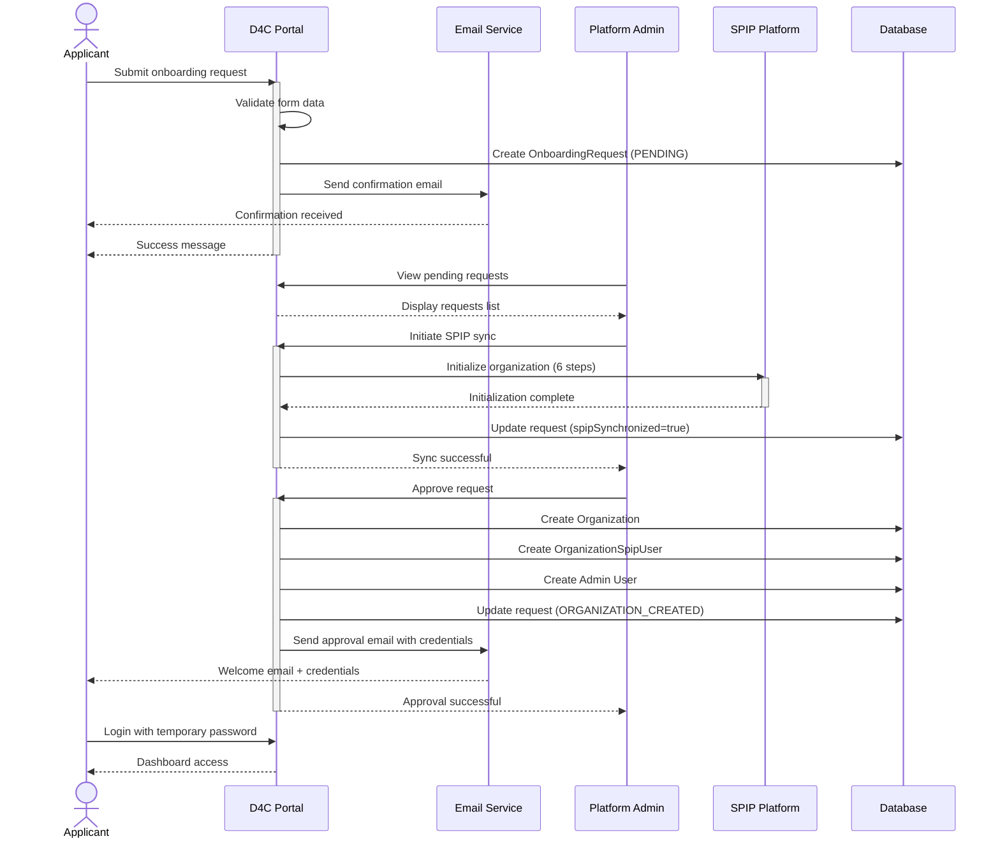
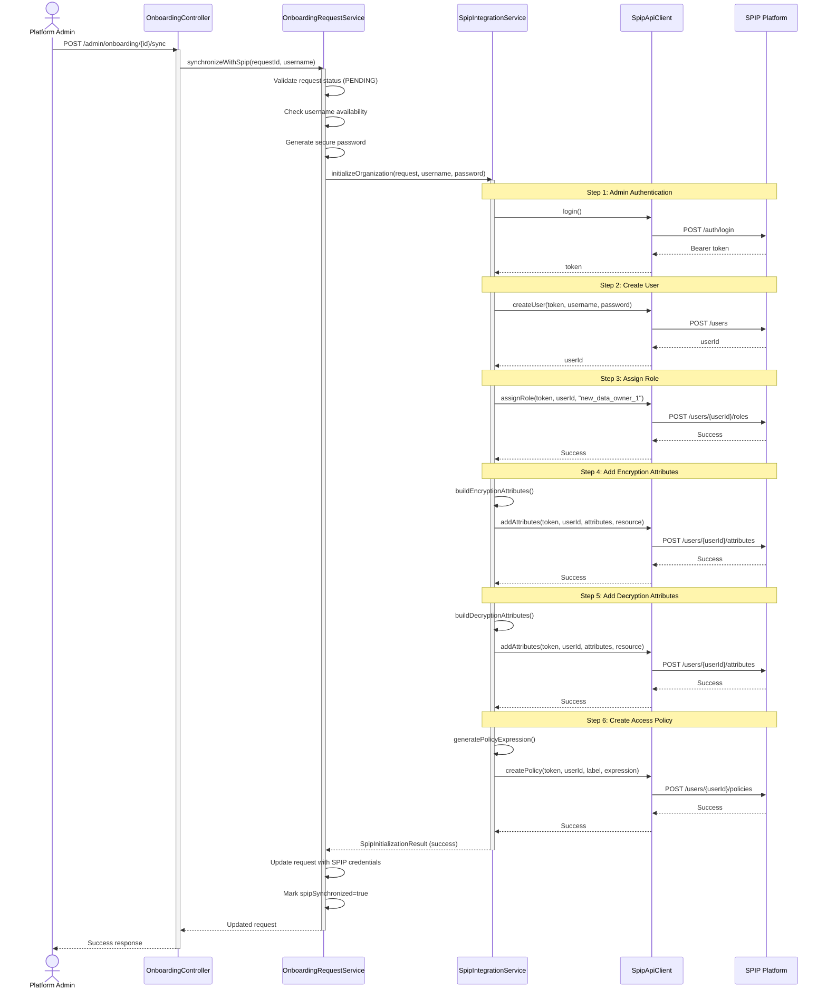
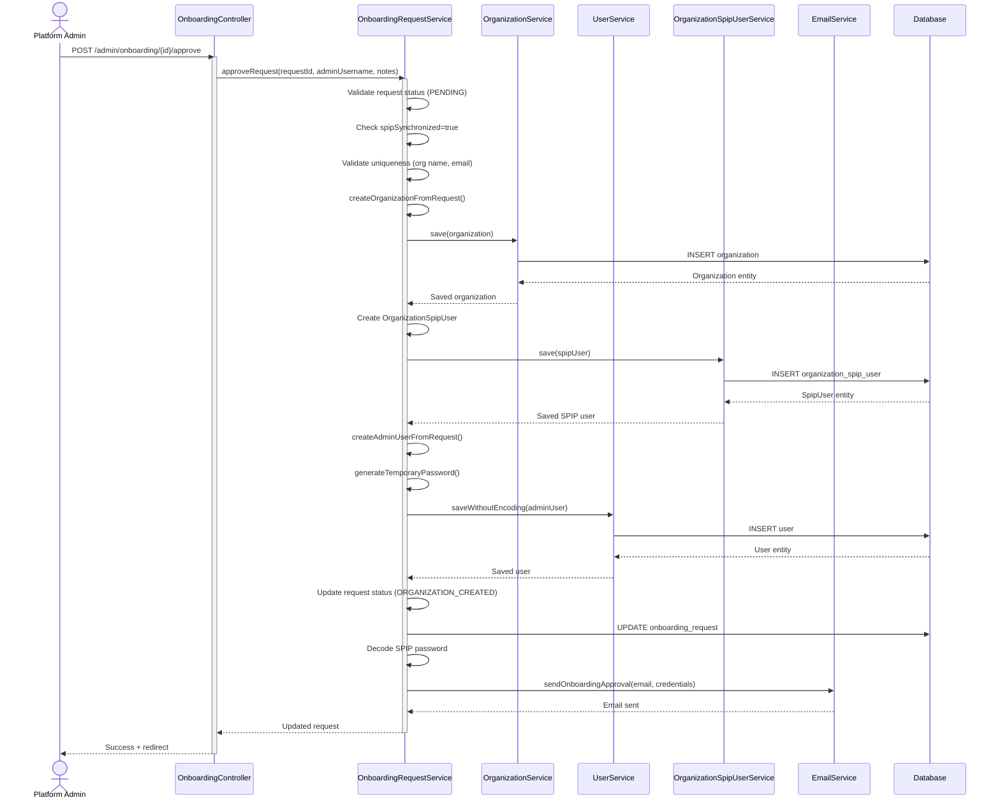
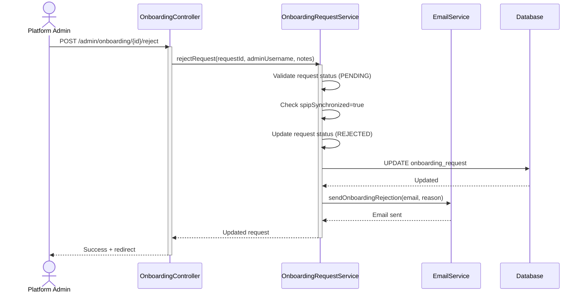

# Organization Onboarding Workflow

This document describes the complete workflow for onboarding new organizations into the DATA4CIRC Portal, including SPIP platform integration.

## Table of Contents

- [Overview](#overview)
- [Workflow Stages](#workflow-stages)
- [Sequence Diagrams](#sequence-diagrams)
- [Detailed Process Description](#detailed-process-description)
- [SPIP Integration](#spip-integration)
- [Email Notifications](#email-notifications)
- [Error Handling](#error-handling)

---

## Overview

The onboarding workflow is a multi-step process that allows new organizations to join the DATA4CIRC Portal with integrated SPIP (Secure Privacy-Preserving Infrastructure Platform) capabilities. The process ensures proper validation, security, and seamless integration with the SPIP platform for secure data sharing.

### Key Features

- Self-service organization registration
- Admin approval workflow
- Automated SPIP platform initialization
- Secure credential generation and distribution
- Email notifications at each stage
- Comprehensive audit trail

---

## Workflow Stages

The onboarding process consists of the following stages:

1. **PENDING** - Initial request submitted, awaiting admin review
2. **SPIP Synchronization** - SPIP credentials generated and platform initialized
3. **ORGANIZATION_CREATED** - Request approved, organization and admin user created
4. **REJECTED** - Request denied by admin

---

## Sequence Diagrams

### 1. Complete Onboarding Workflow (High-Level)



### 2. SPIP Synchronization (Detailed)



### 3. Approval Workflow



### 4. Rejection Workflow



---

## Detailed Process Description

### Phase 1: Request Submission

**User Actions:**
1. Navigate to `/public/join`
2. Fill out onboarding form with:
   - Organization details (name, type, size, industry)
   - Contact information (name, title, email, phone)
   - Organization description
   - Address and website
3. Submit the form

**System Actions:**
1. Validate form data (uniqueness checks)
2. Create `OrganizationOnboardingRequest` with status `PENDING`
3. Send confirmation email to applicant
4. Return success message

**Validation Rules:**
- Email must be unique (not in existing requests or users)
- Company name must be unique (not in existing requests or organizations)
- All required fields must be filled

### Phase 2: SPIP Synchronization

**Admin Actions:**
1. Navigate to `/admin/onboarding`
2. View pending requests
3. Click "Synchronize with SPIP" button
4. Enter SPIP username (defaults to sanitized company name)
5. Confirm synchronization

**System Actions:**

#### Step 1: Authentication
- Login to SPIP platform with admin credentials
- Obtain bearer token for subsequent API calls

#### Step 2: User Creation
- Create new SPIP user with generated username and password
- Password requirements:
  - 16 characters long
  - At least one uppercase letter
  - At least one lowercase letter
  - At least one numeral
  - At least one special character (!@#$%^&*)

#### Step 3: Role Assignment
- Assign `new_data_owner_1` role to the new user
- This role allows the organization to encrypt and share data

#### Step 4: Encryption Attributes
Create attributes for data encryption:
- **orgType**: Mapped from company type (manufacturer, recycler, etc.)
- **industrySector**: Sanitized industry sector
- **orgId**: SPIP username (unique organization identifier)

#### Step 5: Decryption Attributes
Create attributes for data decryption (symmetric with encryption):
- Same attributes as encryption for symmetric access control

#### Step 6: Access Policy
Create access policy with expression:
```
user:orgType-is-{type} and user:industrySector-is-{industry}
```

**Storage:**
- SPIP username: Stored as-is
- SPIP password: AES-256 encrypted at rest (via JPA `EncryptedStringConverter`)
- Initialization result: Serialized to JSON and stored in `initialization_setup` field

### Phase 3: Approval/Rejection

**Admin Actions:**
1. Review the synchronized request
2. View SPIP initialization details
3. Choose to approve or reject

#### Approval Process

**Pre-Approval Checks:**
- Request must be in PENDING status
- SPIP synchronization must be completed
- Organization name must not exist
- User email must not exist

**Entity Creation:**

1. **Organization**
   - Name, type, size, industry sector
   - Contact details
   - Certification status: ACTIVE
   - Description from request

2. **OrganizationSpipUser**
   - Links organization to SPIP credentials
   - Stores username and AES-256 encrypted password
   - Marks as synchronized

3. **Admin User**
   - Username: User's email address
   - Role: ORG_ADMIN
   - Temporary password (12 characters, random)
   - Linked to organization

**Status Update:**
- Request status: ORGANIZATION_CREATED
- Processed by: Admin username
- Processed at: Current timestamp
- Admin notes: Optional notes

**Email Notification:**
- Subject: "Welcome to DATA4CIRC Portal"
- Contains:
  - Portal login credentials (username + temporary password)
  - SPIP credentials (username + decoded password)
  - Next steps and documentation links

#### Rejection Process

**Pre-Rejection Checks:**
- Request must be in PENDING status
- SPIP synchronization must be completed (prevents rejection before sync)

**Status Update:**
- Request status: REJECTED
- Processed by: Admin username
- Processed at: Current timestamp
- Admin notes: Required (rejection reason)

**Email Notification:**
- Subject: "DATA4CIRC Onboarding Request Update"
- Contains:
  - Rejection notice
  - Admin's rejection reason
  - Contact information for questions

---

## SPIP Integration

### SpipIntegrationService

The `SpipIntegrationService` orchestrates the complete SPIP initialization workflow. It implements a 6-step process that is atomic - if any step fails, the entire initialization fails.

**Location:** `com.data4circ.portal.spip.service.SpipIntegrationService`

### SpipApiClient

Low-level HTTP client for SPIP platform REST API.

**Location:** `com.data4circ.portal.spip.client.SpipApiClient`

**Configuration:** `application.yml`
```yaml
spip:
  api:
    base-url: http://localhost:5001
    admin-username: admin
    admin-password: admin_password
  default-role: new_data_owner_1
  resources:
    encrypt-attributes: /attributes/encrypt
    decrypt-attributes: /attributes/decrypt
```

### Attribute Mapping

| Onboarding Field | SPIP Attribute | Sanitization |
|------------------|----------------|--------------|
| companyType | orgType | manufacturer, recycler, remanufacturer, supplier, research, association, other |
| industry | industrySector | lowercase, replace spaces/hyphens with underscores |
| (generated) | orgId | SPIP username |

### Policy Expression Format

Policies use SPIP's attribute-based access control (ABAC) syntax:

```
user:attribute-is-value and user:attribute-is-value
```

Example:
```
user:orgType-is-manufacturer and user:industrySector-is-automotive_recycling
```

---

## Email Notifications

### 1. Onboarding Confirmation

**Trigger:** Request submission
**Recipient:** Applicant
**Template:** `templates/email/onboarding-confirmation.html`

**Content:**
- Acknowledgment of request receipt
- Expected timeline
- Contact information

### 2. Onboarding Approval

**Trigger:** Request approval
**Recipient:** Applicant (now organization admin)
**Template:** `templates/email/onboarding-approved.html`

**Content:**
- Welcome message
- Portal credentials:
  - Username: `{email}`
  - Temporary password: `{generated}`
- SPIP credentials:
  - SPIP Username: `{spipUsername}`
  - SPIP Password: `{decodedPassword}`
- Next steps:
  - Login to portal
  - Change temporary password
  - Explore dashboard
  - Configure connectors

### 3. Onboarding Rejection

**Trigger:** Request rejection
**Recipient:** Applicant
**Template:** `templates/email/onboarding-rejected.html`

**Content:**
- Rejection notice
- Admin's reason
- Contact information for questions
- Invitation to reapply (if applicable)

---

## Error Handling

### Validation Errors

**During Submission:**
- Duplicate email: "An onboarding request with this email already exists"
- Duplicate company name: "An onboarding request with this company name already exists"
- Existing organization: "An organization with this name already exists in the system"

**During SPIP Sync:**
- Invalid status: "Only pending requests can be synchronized with SPIP"
- Duplicate username: "SPIP username '{username}' is already taken. Please choose a different name."

**During Approval:**
- Invalid status: "Only pending requests can be approved"
- Not synchronized: "SPIP synchronization must be completed before approving the request"
- Already processed: "This request has already been processed"
- Duplicate organization: "An organization with name '{name}' already exists"
- Duplicate user: "A user with email '{email}' already exists"

### SPIP Integration Errors

**Authentication Failure:**
- Error: "Admin authentication failed"
- Resolution: Check SPIP admin credentials in configuration

**User Creation Failure:**
- Error: "User creation failed: {reason}"
- Resolution: Check username uniqueness, password requirements

**Role Assignment Failure:**
- Error: "Role assignment failed: {reason}"
- Resolution: Verify role exists in SPIP platform

**Attribute Addition Failure:**
- Error: "Encryption/Decryption attributes addition failed: {reason}"
- Resolution: Check attribute format, resource URLs

**Policy Creation Failure:**
- Error: "Policy creation failed: {reason}"
- Resolution: Verify policy expression syntax

### Recovery

**Failed SPIP Synchronization:**
1. Review error message in admin interface
2. Fix underlying issue (credentials, connectivity, etc.)
3. Retry synchronization with same or different username

**Failed Approval:**
1. Review error message
2. Check database state (organization, user existence)
3. Fix data conflicts
4. Retry approval

**Rollback:**
- SPIP synchronization failures do NOT create partial data in SPIP
- Each API call is independent, but the result object tracks which steps succeeded
- Approval failures may require manual cleanup if organization was created but user creation failed

---

## Security Considerations

### Password Generation

**Portal Passwords:**
- 12 characters minimum
- Mix of uppercase, lowercase, numbers, special characters
- Securely random (using `java.security.SecureRandom`)
- BCrypt encoded before storage

**SPIP Passwords:**
- 16 characters minimum
- SPIP requirements: uppercase, lowercase, numeral, special character
- AES-256 encrypted at rest in database (via JPA `EncryptedStringConverter`)
- Automatically decrypted when read by JPA for SPIP API authentication

### Credential Storage

**Database:**
- Portal passwords: BCrypt hashed (never stored in plaintext)
- SPIP passwords: AES-256 encrypted at rest (decrypted transparently by JPA for SPIP API authentication)
- SPIP passwords in `OrganizationSpipUser` table (organization-scoped)

**Email Transmission:**
- Sent once via encrypted SMTP connection
- Temporary password requires change on first login
- SPIP password is organization's permanent credential

### Access Control

**Onboarding Management:**
- Only `PLATFORM_ADMIN` role can approve/reject requests
- Organization members cannot access onboarding admin interface

**SPIP Data Access:**
- `PLATFORM_ADMIN`: Can view any organization's SPIP data
- `ORG_ADMIN`, `SPIP_PRIVILEGED_USER`: Can view own organization's SPIP data
- `ORG_MEMBER`: No SPIP access (configurable)

---

## API Endpoints

### Public Endpoints

```
GET  /public/join              # Display onboarding form
POST /public/join              # Submit onboarding request
```

### Admin Endpoints (PLATFORM_ADMIN only)

```
GET  /admin/onboarding                    # List all requests
GET  /admin/onboarding/{id}              # View request details
POST /admin/onboarding/{id}/sync         # Synchronize with SPIP
POST /admin/onboarding/{id}/approve      # Approve request
POST /admin/onboarding/{id}/reject       # Reject request
```

---

## Database Schema

### onboarding_requests

| Column | Type | Description |
|--------|------|-------------|
| id | BIGINT | Primary key |
| company_name | VARCHAR(255) | Organization name |
| company_type | VARCHAR(100) | Type of organization |
| industry | VARCHAR(255) | Industry sector |
| company_size | VARCHAR(50) | Size category |
| contact_name | VARCHAR(255) | Primary contact |
| contact_title | VARCHAR(255) | Contact's job title |
| email | VARCHAR(255) | Contact email (unique) |
| phone | VARCHAR(50) | Contact phone |
| website | VARCHAR(255) | Organization website |
| address | TEXT | Physical address |
| organization_description | TEXT | User-provided description |
| status | VARCHAR(50) | PENDING, ORGANIZATION_CREATED, REJECTED |
| spip_user | VARCHAR(255) | Generated SPIP username |
| spip_password | TEXT | AES-256 encrypted SPIP password |
| spip_synchronized | BOOLEAN | SPIP initialization complete |
| initialization_setup | TEXT | JSON of SPIP setup result |
| processed_by | VARCHAR(255) | Admin username |
| processed_at | TIMESTAMP | Processing timestamp |
| admin_notes | TEXT | Admin comments |
| organization_id | BIGINT | FK to created organization |
| created_at | TIMESTAMP | Request creation time |
| updated_at | TIMESTAMP | Last update time |

---

## Testing

### Manual Testing Checklist

**Submission:**
- [ ] Submit valid request
- [ ] Submit with duplicate email (should fail)
- [ ] Submit with duplicate company name (should fail)
- [ ] Verify confirmation email received

**SPIP Synchronization:**
- [ ] Sync with default username
- [ ] Sync with custom username
- [ ] Attempt sync with duplicate username (should fail)
- [ ] Verify SPIP platform received all data
- [ ] Check initialization_setup JSON stored

**Approval:**
- [ ] Approve synchronized request
- [ ] Verify organization created
- [ ] Verify admin user created
- [ ] Verify SPIP user link created
- [ ] Check approval email received with credentials
- [ ] Login with portal credentials
- [ ] Verify SPIP credentials work

**Rejection:**
- [ ] Reject synchronized request
- [ ] Verify rejection email received
- [ ] Confirm request marked as rejected

**Error Cases:**
- [ ] Approve without SPIP sync (should fail)
- [ ] Approve already processed request (should fail)
- [ ] Sync with SPIP platform down (should fail gracefully)

### Integration Tests

See: `src/test/java/com/data4circ/portal/integration/OnboardingFlowIntegrationTest.java`

---

## Future Enhancements

### Potential Improvements

1. **Auto-Approval:** Configure rules for automatic approval of certain organization types
2. **Multi-Step Forms:** Break long form into wizard with progress indicator
3. **Document Upload:** Allow applicants to upload certification documents
4. **SPIP Verification:** Automatic health check of SPIP credentials post-creation
5. **Bulk Operations:** Admin ability to approve/reject multiple requests
6. **Waiting List:** Queue system for when platform reaches capacity
7. **Organization Self-Service:** Allow organizations to update their SPIP attributes
8. **Audit Dashboard:** Visual timeline of onboarding process steps
9. **Webhooks:** Notify external systems of onboarding events
10. **Multi-Language:** Support for internationalized onboarding forms

---

## References

- [SPIP Platform Documentation](https://github.com/spip-project/spip-docs)
- [Spring Security Configuration](../../../src/main/java/com/data4circ/portal/common/config/SecurityConfig.java)
- [OnboardingRequestService](../../../src/main/java/com/data4circ/portal/features/organization/service/OnboardingRequestService.java)
- [SpipIntegrationService](../../src/main/java/com/data4circ/portal/integration/spip/service/SpipIntegrationService.java)

---

**Document Version:** 1.0
**Last Updated:** 2025-11-11
**Author:** DATA4CIRC Development Team
